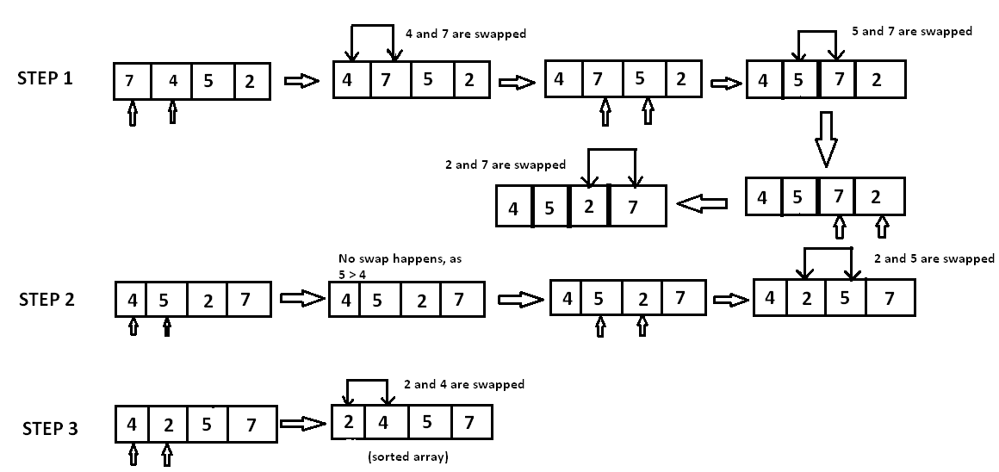

# Bubble Sort

Bubble sort algorithm repeatedly compare adjacent index value and swapping there values if element order is wrong. This
is done till end of the array is reached.



```java
import java.util.*;

public class BubbleSortAscendingOptimized {
    public static void main(String arg[]) {
        int arr[] = {4, 2, 1, 3};
        bubbleSort(arr);
        for (int i : arr) {
            System.out.print("\t" + i);
        }
    }

    public static int[] bubbleSort(int arr[]) {
        for (int i = 0; i < arr.length; i++) {
            boolean isSwaped = false;
            for (int j = 0; j < arr.length - 1 - i; j++) {
                if (arr[j] > arr[j + 1]) {
                    int temp = arr[j];
                    arr[j] = arr[j + 1];
                    arr[j + 1] = temp;
                    isSwaped = true;
                }
            }
            if (!isSwaped)
                break;
        }
        return arr;
    }
}

```